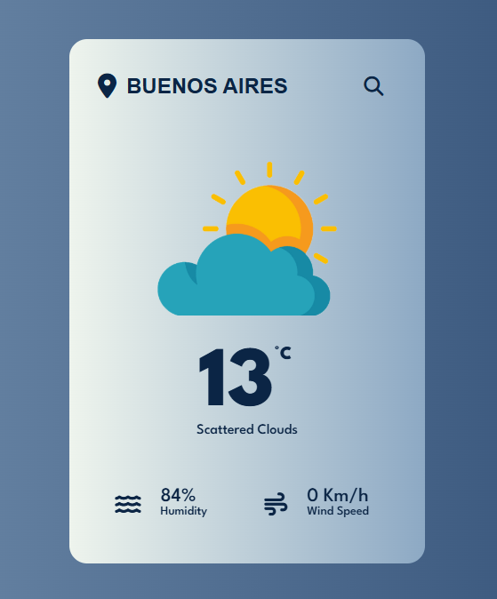

# Weather App 🌤️

A clean and responsive weather application built with HTML, CSS, and JavaScript. It fetches real-time weather data from the OpenWeatherMap API and displays current temperature, humidity, wind speed, and a relevant weather icon.

---

## Demo Preview

<p align="center">
  
</p>
<p align="center"><em>Search interface prompting city input</em></p>


<p align="center">
  
</p>
<p align="center"><em>Weather preview for Buenos Aires</em></p>

---

## Technologies Used

- HTML5
- CSS3
- JavaScript (DOM manipulation, Fetch API)
- OpenWeatherMap API
- Font Awesome

---

## Setup Instructions

**1. Clone the repository**

```bash
git clone https://github.com/ImanolBarrionuevo/learning-by-building.git
```

**2. Launch the project**
Open index.html in your browser directly, or serve it locally using a simple web server.

**3. Insert your OpenWeatherMap API key**
Inside the file script.js, go to line 10 and replace the placeholder with your own key:
```bash
const APIKey = 'Your_API_Key_Here';
```
You can sign up and get a free API key from https://openweathermap.org.

---

## Credits

This project was inspired by AsmrProg’s tutorial on YouTube:  
[🔗 Watch the original video](https://www.youtube.com/watch?v=iILFBGm_I9M)

While the core structure was based on the tutorial, the final UI/UX and animations were custom-tailored during my learning process.
